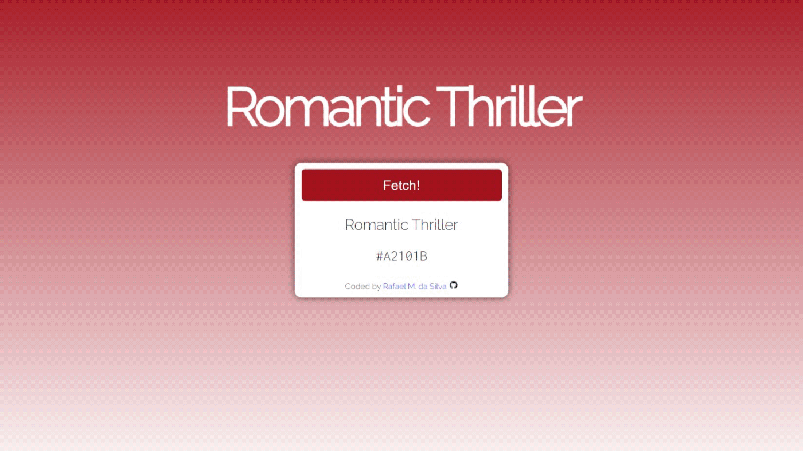

## Shady Shader

This is a simple color picker that utilizes an API to fetch random colors, built with HTML, CSS and JavaScript.

### Features

- Random Color Generation
- API Integration
- User-Friendly Interface

### To-Do

- Some sort of animation
- Responsive design
- Further code optimization

### Live Demo

### Contributions

Feel free to make any suggestions by creating an issue.

### Acknowledgments

Special thanks to the team at [Color Names](https://github.com/meodai/color-names "Color Names") for providing the API that powers this project.

### Disclaimer

The names fetched from the API are for **depiction only** and may not reflect my own personal opinions or beliefs.